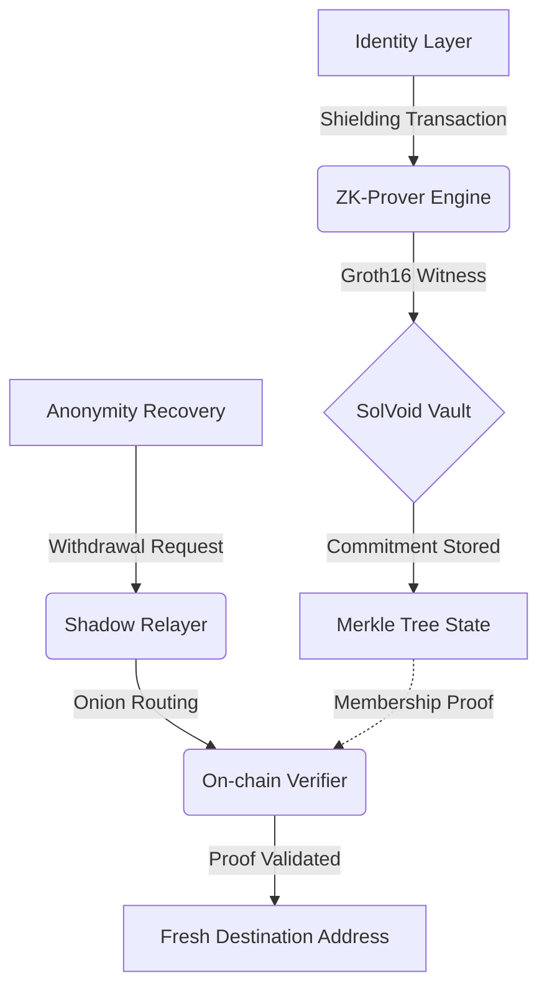

# SolVoid: Institutional-Grade Privacy Infrastructure for Solana

<div align="center">
  
</div>

[](https://solvoid.io)
[](https://opensource.org/licenses/MIT)
[](./ZK_REFERENCE.md)

SolVoid is a high-performance, non-custodial privacy protocol designed for the Solana ecosystem. By leveraging **Groth16 Zero-Knowledge Proofs** and circuit-optimized **Poseidon-3 hashing**, SolVoid enables cryptographically unlinkable asset transfers and identity obfuscation with minimal latency.

---

## 🏛 Technical Architecture

SolVoid orchestrates a multi-layered privacy lifecycle (PLM) that decouples on-chain identities from their transaction history while maintaining full protocol verifiability.

### Operational Data Flow


---

## 🚀 Protocol Specifications

| Feature | Technical Specification |
|:---|:---|
| **Zero-Knowledge** | Groth16 proofs on BN254 curve with verified R1CS constraints |
| **Privacy Scoring** | HEURISTIC-optimized "Ghost Score" (0-100) for anonymity auditing |
| **Atomic Rescue** | Automated rotation of leaked assets for compromised wallets |
| **Onion Routing** | Multi-hop RSA-OAEP encryption for transaction obfuscation |
| **Data Integrity** | Strict schema enforcement across CLI, SDK, and API boundaries |

---

## 📦 technical Deployment

### 1. Environment Initialization
```bash
git clone https://github.com/brainless3178/SolVoid.git
cd SolVoid
npm install
```

### 2. ZK Proving Pipeline
Ensure `circom` and `snarkjs` are available in the local binary path.
```bash
./scripts/build-zk.sh
```

---

## 🛠 Command Orchestration (CLI)

### Execute Private Deposit (Shielding)
```bash
solvoid shield 1.5
```
*Requirement: Persist the returned Secret and Nullifier keys. Loss of these primitives results in permanent asset sequestration.*

### Execute Unlinkable Withdrawal
```bash
# format: solvoid withdraw <amount> <recipient> --secret <key> --nullifier <key>
solvoid withdraw 1.5 <RECIPIENT_ADDRESS> --secret 0x... --nullifier 0x...
```

---

## 📖 Project Reference Documentation

Our technical documentation is partitioned by infrastructure layer:

- **Protocol Core:** [DOCS.md](DOCS.md) | [ZK_REFERENCE.md](ZK_REFERENCE.md) | [GHOST_REFERENCE.md](GHOST_REFERENCE.md)
- **Integration Layer:** [SDK_REFERENCE.md](SDK_REFERENCE.md) | [CLI_REFERENCE.md](CLI_REFERENCE.md) | [API_REFERENCE.md](API_REFERENCE.md)
- **Operations:** [CICD_REFERENCE.md](CICD_REFERENCE.md) | [SYSTEM_STATUS.md](SYSTEM_STATUS.md) | [DEPLOYMENT.md](DEPLOYMENT.md)

---

## 🔒 Security Compliance

Protocol integrity is the core focus of the SolVoid Engineering team.

- **Current Status:** Experimental Beta
- **Audit Path:** Undergoing internal peer review; third-party audit scheduled for Q2.
- **Vulnerability Policy:** Refer to [SECURITY.md](SECURITY.md) for disclosure protocols.

---
*Engineering-First. Privacy-Preserving. Solana-Native.*
