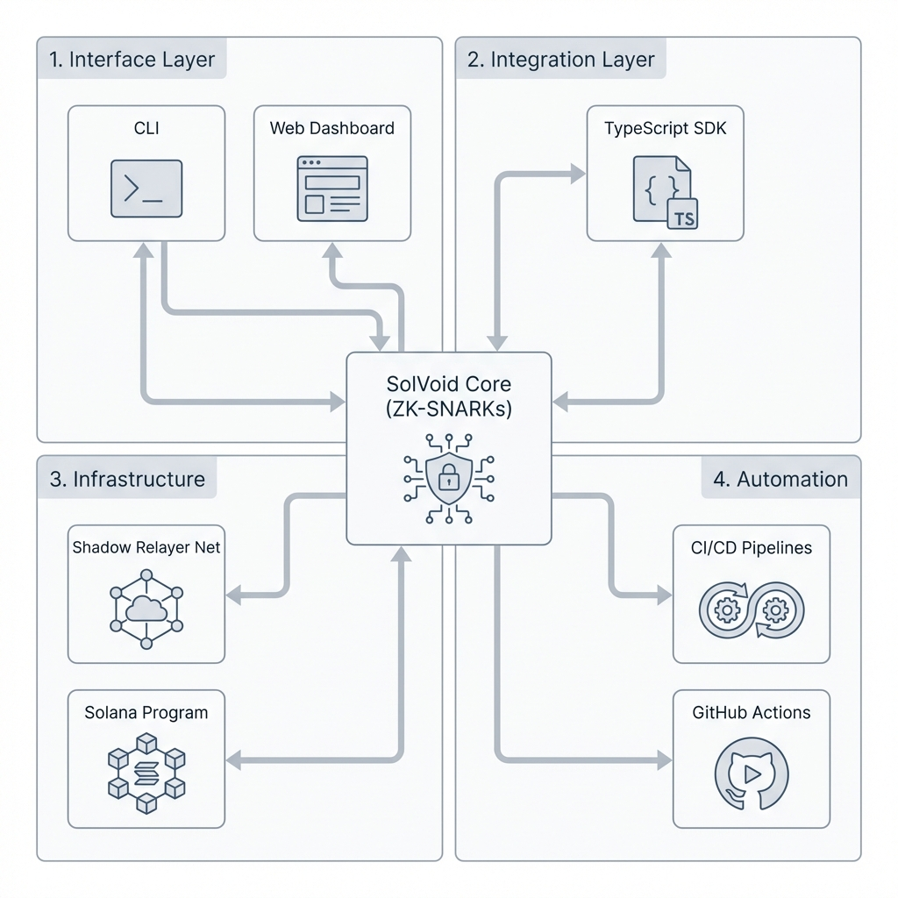
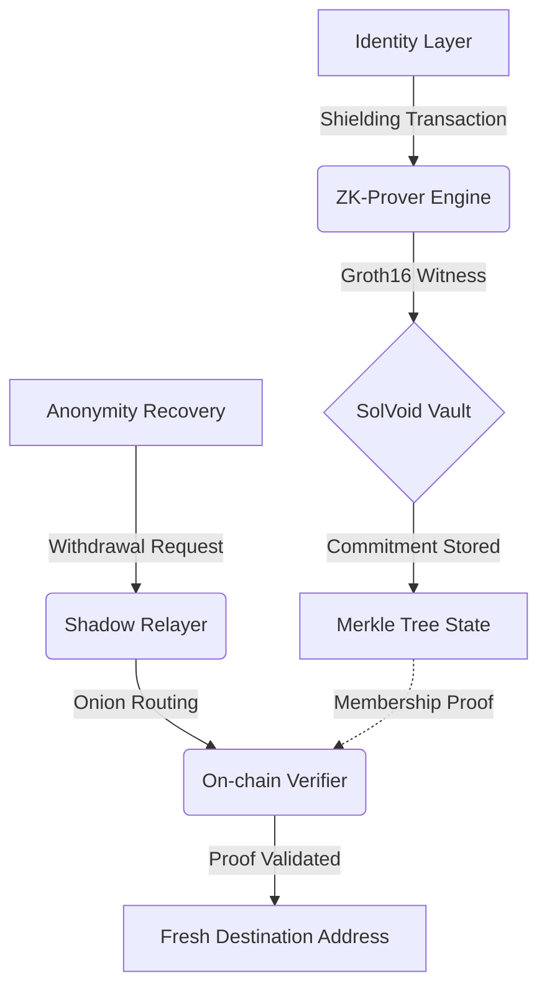

# SolVoid: Institutional-Grade Privacy Infrastructure for Solana

<div align="center">
  
</div>

[](https://solvoid.io)
[](https://opensource.org/licenses/MIT)
[](./ZK_REFERENCE.md)

SolVoid is a high-performance, non-custodial privacy protocol designed for the Solana ecosystem. By leveraging **Groth16 Zero-Knowledge Proofs** and circuit-optimized **Poseidon-3 hashing**, SolVoid enables cryptographically unlinkable asset transfers and identity obfuscation with sub-second latency.

---

## 🏛 Technical Architecture

SolVoid orchestrates a multi-layered privacy lifecycle (PLM) that decouples on-chain identities from their transaction history while maintaining full protocol verifiability.

### Operational Data Flow


---

## 🚀 Ecosystem Infrastructure & Features

### 1. Advanced Zero-Knowledge Stack
- **Groth16 Proving Pipeline**: High-performance proving implementation on the **BN254 curve**.
- **Poseidon-3 Hashing**: Standardized sponge construction ensuring 100% hash parity across **Circom (circuits)**, **Rust (Anchor program)**, and **TypeScript (SDK)**.
- **20-Level Merkle Tree**: Optimized sparse tree supporting over 1.04M unique commitments per pool.

### 2. Specialized ZK Circuitry
- **`withdraw.circom`**: Orchestrates nullifier verification, Merkle membership checks, and public signal binding.
- **`rescue.circom`**: A specialized emergency circuit for the Atomic Rescue Engine, enabling private migration of assets from compromised identities.
- **`merkleTree.circom`**: Efficient logarithmic witness generation for state membership.

### 3. On-Chain Cryptoeconomics & Programs
- **Anchor Protocol**: A secure on-chain verifier and state management layer.
- **Nullifier Management**: Persistent on-chain nullifier tracking to prevent double-spending without leaking deposit history.
- **Protocol Economics**: Integrated fee-distribution and relayer-bounty mechanisms implemented in `economics.rs`.

### 4. Shadow Relayer Network (Onion Routing)
- **Identity Decoupling**: RSA-OAEP multi-hop encryption ensures the destination identity is never linked to the origin RPC metadata.
- **Gasless Withdrawals**: Users can execute withdrawals without maintaining native SOL in the destination wallet; fees are deducted directly from the shielded commitment.

### 5. Privacy Ghost Score (Anonymity Audit)
- **Heuristic Diagnostic Engine**: Quantifies wallet privacy (0-100) by analyzing transaction-graph entropy, identity linkage, and temporal correlations.
- **Social Artifacts**: Generate ZK-verified "Privacy Badges" to prove anonymity status without revealing sensitive data.

### 6. Atomic Rescue Engine (MEV Protection)
- **Jito Integration**: Leverages the **Jito-Solana mev-bundle** for sub-2s critical execution, protecting assets from front-running and sandwich attacks during emergency rotations.
- **Private Migration**: Automates the batch-shielding process to transit leaked assets into a secure, private state.

### 7. Global Command Center (CLI & Dashboard)
- **SolVoid CLI**: High-performance terminal interface for system-wide orchestration, rescue ops, and auditing.
- **Web Dashboard**: An institutional-grade Next.js interface providing real-time protocol telemetry, vault liquidity snapshots, and individual privacy audit histories.

### 8. Quality Assurance & Engineering Standards
- **Strict Data Integrity (DIE)**: Zod-powered schema enforcement at every operational boundary (CLI, API, SDK).
- **Comprehensive Test Suite**: Unit, integration, and E2E testing using **Jest** and **Anchor Test**, ensuring ZK circuit parity and state consistency.
- **Automated CI/CD**: Optimized GitHub Actions for continuous deployment and cryptographic validation.

---

## 🛠 Command Orchestration & Implementation

### 1. Environment Initialization
Standard procedures for initializing the SolVoid development and deployment environment.

```bash
# Clone and Initialize
git clone https://github.com/brainless3178/SolVoid.git
cd SolVoid
npm install

# ZK Proving Pipeline Initialization
# Ensure circom and snarkjs are present in the system path
./scripts/build-zk.sh

# On-Chain Deployment (Anchor)
anchor build
anchor deploy --provider.cluster devnet
```

### 2. CLI Command Specification (`solvoid`)
Standard orchestration for protocol interaction and emergency remediation.

#### **Shielding (Deposit)**
```bash
solvoid shield <amount>
```

#### **Withdrawal (Unlinking)**
```bash
solvoid withdraw <secret> <nullifier> <recipient> <amount> [flags]
```
| Flag | Description | Default |
|:---|:---|:---|
| `--relayer <url>` | Target Shadow Relayer endpoint | `http://localhost:8080` |
| `--rpc <url>` | Override default Solana RPC | `.env` default |

#### **Ghost Score (Anonymity Audit)**
```bash
solvoid ghost <address> [flags]
```
| Flag | Description |
|:---|:---|
| `--badge` | Generate a ZK-verified privacy badge artifact |
| `--json` | Return raw audit data for programmatic ingestion |

#### **Atomic Rescue (Emergency Remediation)**
```bash
solvoid rescue <wallet_input> [flags]
```
| Flag | Description |
|:---|:---|
| `--to <address>` | Specified recovery destination for remediated assets |
| `--emergency` | Escalated priority for Jito-MEV critical execution |

---

### 3. SDK Integration Patterns
```typescript
import { SolVoidClient } from 'solvoid';

const client = new SolVoidClient(config, wallet);
const { commitmentData } = await client.shield(1.5 * LAMPORTS_PER_SOL);
const passport = await client.getPassport(address);
```

### 4. Relayer API Specification
| Endpoint | Method | Data Requirement |
|:---|:---|:---|
| `/status` | `GET` | Service health & metrics |
| `/commitments` | `GET` | Merkle state synchronization |
| `/relay` | `POST` | `transaction` (base64) & `hops` (1-5) |

---

## 📖 Reference Documentation Partitioning

- **Protocol Core:** [DOCS.md](DOCS.md) | [ZK_REFERENCE.md](ZK_REFERENCE.md) | [GHOST_REFERENCE.md](GHOST_REFERENCE.md)
- **Integration Layer:** [SDK_REFERENCE.md](SDK_REFERENCE.md) | [CLI_REFERENCE.md](CLI_REFERENCE.md) | [API_REFERENCE.md](API_REFERENCE.md)
- **Operations:** [CICD_REFERENCE.md](CICD_REFERENCE.md) | [SYSTEM_STATUS.md](SYSTEM_STATUS.md) | [DEPLOYMENT.md](DEPLOYMENT.md)

---

## 🔒 Security Compliance
- **Status:** Experimental Beta
- **Audit Path:** Undergoing internal peer review; third-party audit scheduled for Q2.
- **Policy:** Refer to [SECURITY.md](SECURITY.md) for disclosure protocols.

---
*Engineering-First. Privacy-Preserving. Solana-Native.*
