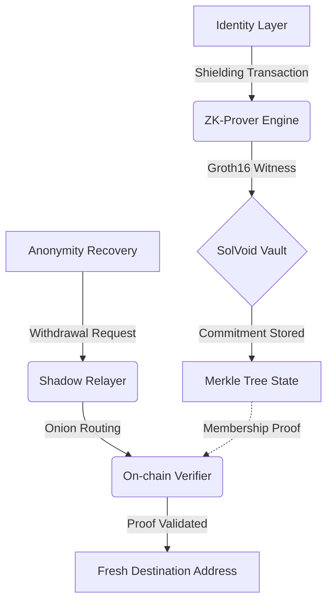

# SolVoid: Institutional-Grade Privacy Infrastructure for Solana

<div align="center">
  
</div>

[](https://solvoid.io)
[](https://opensource.org/licenses/MIT)
[](./ZK_REFERENCE.md)

SolVoid is a high-performance, non-custodial privacy protocol designed for the Solana ecosystem. By leveraging **Groth16 Zero-Knowledge Proofs** and circuit-optimized **Poseidon-3 hashing**, SolVoid enables cryptographically unlinkable asset transfers and identity obfuscation with sub-second latency.

---

## 🏛 Technical Architecture

SolVoid orchestrates a multi-layered privacy lifecycle (PLM) that decouples on-chain identities from their transaction history while maintaining full protocol verifiability.

### Operational Data Flow


---

## � Project Lifecycle & Orchestration

### 1. Environment & Deployment Hub
The foundation for building, testing, and deploying the SolVoid protocol.

```bash
# Repository Initialization
git clone https://github.com/brainless3178/SolVoid.git
cd SolVoid
npm install

# ZK Cryptographic Pipeline
# Compiles circuits and generates proving/verification keys
./scripts/build-zk.sh

# On-Chain Program Lifecycle (Anchor)
anchor build
anchor deploy --provider.cluster devnet

# Quality Assurance Suite
npm test               # Execute full test matrix
npm run lint           # Static code analysis
npm run dashboard:dev  # Launch local UI environment
```

### 2. CLI Command Specification (`solvoid`)
The primary interface for protocol interaction, auditing, and emergency response.

#### **Surgical Shielding (Deposit)**
```bash
solvoid shield <amount>
```
*   **Args**: `<amount>` (SOL to shield)
*   **Protocol Action**: Generates `Secret` and `Nullifier` keys and commits hashed state to the Merkle tree.

#### **Unlinkable Withdrawal**
```bash
solvoid withdraw <secret> <nullifier> <recipient> <amount> [options]
```
| Option | Description | Default |
|:---|:---|:---|
| `--relayer <url>`| Target Shadow Relayer endpoint | `.env` default |
| `--rpc <url>`    | Override default Solana RPC | `.env` default |

#### **Privacy Ghost Score (Audit)**
```bash
solvoid ghost <address> [options]
```
| Option | Description |
|:---|:---|
| `--badge`      | Generate a ZK-verified Privacy Badge artifact |
| `--share`      | Generate social metadata for X/Discord platforms |
| `--verify <p>` | Cryptographically validate an external privacy proof |
| `--json`       | Return raw audit data for programmatic ingestion |

#### **Atomic Rescue (MEV Protection)**
```bash
solvoid rescue <wallet> [options]
```
| Option | Description |
|:---|:---|
| `--to <addr>`    | Specified recovery destination address |
| `--auto-generate`| Initialize a fresh, secure remediation wallet |
| `--jito-bundle`  | Utilize Jito-Solana MEV bundles for atomic execution |
| `--emergency`    | Priority fee escalation for sub-2s critical rotation |
| `--dry-run`      | Simulate orchestration without network broadcast |
| `--monitor`      | Activate real-time post-remediation threat alerts |

#### **Protocol Administration (Emergency Controls)**
```bash
solvoid admin <command> [args]
```
| Command | Action |
|:---|:---|
| `pause`               | Trigger the ZK Circuit Breaker to suspend withdrawals |
| `resume`              | Reset breaker and resume protocol operations |
| `trigger-emergency`   | Escalates protocol-wide fee multipliers (x1-x10) |
| `disable-emergency`   | Resets protocol fees to baseline state |

---

### 3. SDK Integration Patterns
A professional integration layer for third-party dApps and services.

```typescript
import { SolVoidClient } from 'solvoid';

// 1. Client Orchestration
const client = new SolVoidClient(config, wallet);

// 2. Surgical Shielding
const { commitmentData } = await client.shield(1.5 * LAMPORTS_PER_SOL);

// 3. Privacy Auditing
const passport = await client.getPassport(address);
console.log(`Ghost Score: ${passport.overallScore}/100`);

// 4. Low-level Proof Generation
const proof = await client.prepareWithdrawal(secret, nullifier, ...);
```

---

### 4. Shadow Relayer API Specification
Technical endpoints for the decentralized relay network.

| Endpoint | Method | Functional Requirement |
|:---|:---|:---|
| `/status` | `GET` | Health monitoring & protocol metrics |
| `/commitments` | `GET` | Multi-hop Merkle state synchronization |
| `/relay` | `POST` | `transaction` (base64) & `hops` (onion routing depth 1-5) |

---

## � Key Ecosystem Infrastructure

*   **Groth16 ZK-SNARKs**: High-performance proving implementation on the **BN254 curve**.
*   **Poseidon-3 Hashing**: Standardized sponge construction for 100% parity across Rust, TS, and Circom.
*   **Jito-MEV Integration**: Advanced front-running protection for critical asset rotations.
*   **Data Integrity Enforcement (DIE)**: Zod-powered schema validation at every operational boundary.
*   **Global Dashboard**: Institutional Next.js interface providing real-time technical telemetry.

---

## 📖 Project Documentation

- **Core:** [DOCS.md](DOCS.md) | [ZK_REFERENCE.md](ZK_REFERENCE.md) | [GHOST_REFERENCE.md](GHOST_REFERENCE.md)
- **Integration:** [SDK_REFERENCE.md](SDK_REFERENCE.md) | [CLI_REFERENCE.md](CLI_REFERENCE.md) | [API_REFERENCE.md](API_REFERENCE.md)
- **Ops:** [CICD_REFERENCE.md](CICD_REFERENCE.md) | [SYSTEM_STATUS.md](SYSTEM_STATUS.md) | [DEPLOYMENT.md](DEPLOYMENT.md)

---

## 🔒 Security Compliance
- **Status:** Experimental Beta
- **Policy:** Refer to [SECURITY.md](SECURITY.md) for disclosure protocols.

---
*Engineering-First. Privacy-Preserving. Solana-Native.*
