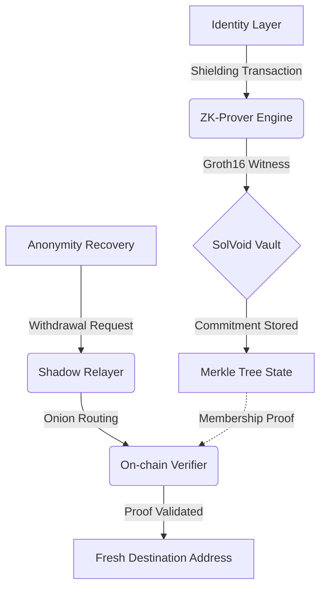

# SolVoid: Institutional-Grade Privacy Infrastructure for Solana

<div align="center">
  
</div>

[](https://solvoid.io)
[](https://opensource.org/licenses/MIT)
[](./ZK_REFERENCE.md)

SolVoid is a high-performance, non-custodial privacy protocol designed for the Solana ecosystem. By leveraging **Groth16 Zero-Knowledge Proofs** and circuit-optimized **Poseidon-3 hashing**, SolVoid enables cryptographically unlinkable asset transfers and identity obfuscation with sub-second latency.

---

## 🏛 Technical Architecture

SolVoid orchestrates a multi-layered privacy lifecycle (PLM) that decouples on-chain identities from their transaction history while maintaining full protocol verifiability.

### Operational Data Flow


---

## 🚀 Deep Dive: Core Ecosystem Features

### 1. Advanced Zero-Knowledge Cryptography
SolVoid utilizes the **BN254 curve** and **Groth16 proofs** to ensure maximum efficiency for client-side witness generation.
*   **Poseidon-3 Hashing**: Implements a circuit-optimized sponge construction, ensuring 100% hash parity across TypeScript (SDK), Rust (Program), and Circom (Circuits).
*   **20-Level Sparse Merkle Tree**: Supports a massive anonymity set of over 1.04 million unique commitments per pool.

### 2. Privacy Ghost Score (Anonymity Auditing)
An integrated heuristic diagnostic engine that quantifies on-chain privacy risk (0-100).
*   **Leak Detection**: Identifies identity linkage via common fee-funding sources, ATA creation history, and transaction-graph entropy.
*   **Remediation Recommendations**: Provides technical analysis for mitigating identified metadata leaks.

### 3. Shadow Relayer Network (Onion Routing)
A decentralized network for gasless, unlinkable withdrawals.
*   **RSA-OAEP Encryption**: Protects withdrawal payloads using recursive encryption layers.
*   **Onion Routing**: Decouples the destination address from the withdrawal request, preventing IP-based linkage or RPC-level tracking.

### 4. Atomic Rescue Engine
An emergency remediation tool-set designed specifically for compromised or "leaky" wallets.
*   **Rapid Asset Rotation**: Orchestrates a prioritized batch-shielding process to migrate liquid assets into a private state in a single session.
*   **Threat Analysis**: Real-time monitoring of transaction logs to detect and front-run potential wallet drainers.

### 5. Data Integrity Enforcement (DIE)
Institutional-grade security layer implemented across the entire stack.
*   **Schema Enforcement**: Utilizes Zod-based validation at every boundary (CLI, SDK, API) to prevent malformed data injection.
*   **Boundary Validation**: Every public key and transaction signature is validated before entering the logic layer.

### 6. Institutional CI/CD & Automation
*   **Automated Verification**: GitHub Action pipelines execute comprehensive suite tests for ZK circuit parity and program state consistency.
*   **Protocol Telemetry**: Real-time monitoring of vault liquidity, relayer health, and network-wide privacy snapshots.

---

## 📦 technical Deployment

### 1. Environment Initialization
```bash
git clone https://github.com/brainless3178/SolVoid.git
cd SolVoid
npm install
```

### 2. ZK Proving Pipeline
Ensure `circom` and `snarkjs` are available in the local binary path.
```bash
./scripts/build-zk.sh
```

---

## 🛠 Command Orchestration (CLI)

### Execute Private Deposit (Shielding)
```bash
solvoid shield 1.5
```
*Requirement: Persist the returned Secret and Nullifier keys. Loss of these primitives results in permanent asset sequestration.*

### Execute Unlinkable Withdrawal
```bash
# format: solvoid withdraw <amount> <recipient> --secret <key> --nullifier <key>
solvoid withdraw 1.5 <RECIPIENT_ADDRESS> --secret 0x... --nullifier 0x...
```

---

## 📖 Project Reference Documentation

Our technical documentation is partitioned by infrastructure layer:

- **Protocol Core:** [DOCS.md](DOCS.md) | [ZK_REFERENCE.md](ZK_REFERENCE.md) | [GHOST_REFERENCE.md](GHOST_REFERENCE.md)
- **Integration Layer:** [SDK_REFERENCE.md](SDK_REFERENCE.md) | [CLI_REFERENCE.md](CLI_REFERENCE.md) | [API_REFERENCE.md](API_REFERENCE.md)
- **Operations:** [CICD_REFERENCE.md](CICD_REFERENCE.md) | [SYSTEM_STATUS.md](SYSTEM_STATUS.md) | [DEPLOYMENT.md](DEPLOYMENT.md)

---

## 🔒 Security Compliance

Protocol integrity is the core focus of the SolVoid Engineering team.

- **Current Status:** Experimental Beta
- **Audit Path:** Undergoing internal peer review; third-party audit scheduled for Q2.
- **Vulnerability Policy:** Refer to [SECURITY.md](SECURITY.md) for disclosure protocols.

---
*Engineering-First. Privacy-Preserving. Solana-Native.*
