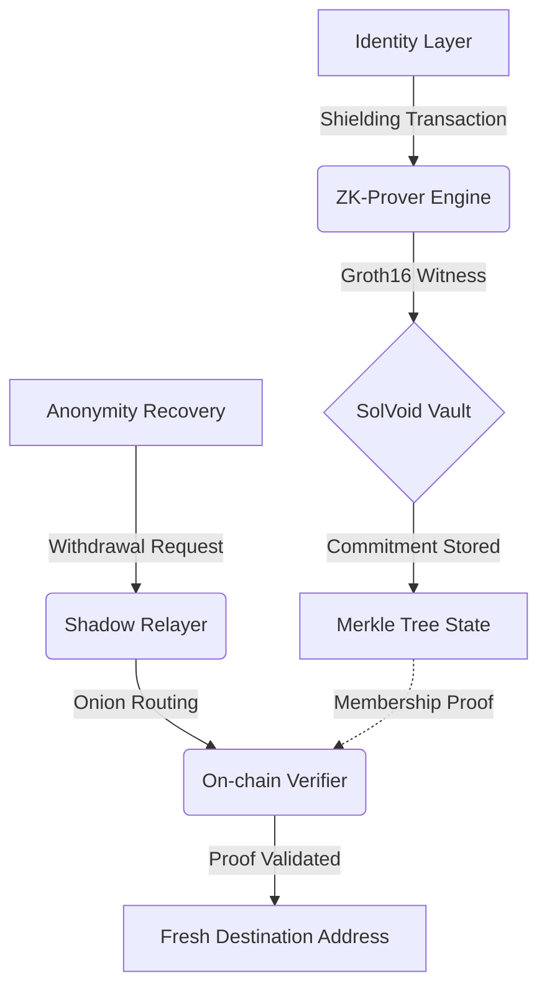

# SolVoid: Institutional-Grade Privacy Infrastructure for Solana

<div align="center">
  
</div>

[](https://solvoid.io)
[](https://opensource.org/licenses/MIT)
[](./ZK_REFERENCE.md)

SolVoid is a high-performance, non-custodial privacy protocol designed for the Solana ecosystem. By leveraging **Groth16 Zero-Knowledge Proofs** and circuit-optimized **Poseidon-3 hashing**, SolVoid enables cryptographically unlinkable asset transfers and identity obfuscation with sub-second latency.

---

## 🏛 Technical Architecture

SolVoid orchestrates a multi-layered privacy lifecycle (PLM) that decouples on-chain identities from their transaction history while maintaining full protocol verifiability.

### Operational Data Flow


---

## 🚀 Ecosystem Reference Documentation

Our technical documentation is partitioned by infrastructure layer:

- **Protocol Core:** [DOCS.md](DOCS.md) | [ZK_REFERENCE.md](ZK_REFERENCE.md) | [GHOST_REFERENCE.md](GHOST_REFERENCE.md)
- **Integration Layer:** [SDK_REFERENCE.md](SDK_REFERENCE.md) | [CLI_REFERENCE.md](CLI_REFERENCE.md) | [API_REFERENCE.md](API_REFERENCE.md)
- **Operations:** [CICD_REFERENCE.md](CICD_REFERENCE.md) | [SYSTEM_STATUS.md](SYSTEM_STATUS.md) | [DEPLOYMENT.md](DEPLOYMENT.md)

---

## 🛠 Command Orchestration & Implementation

### 1. Environment & Deployment Initialization
Standard procedures for initializing the SolVoid development and deployment environment.

```bash
# Clone and Initialize
git clone https://github.com/brainless3178/SolVoid.git
cd SolVoid
npm install

# ZK Proving Pipeline Initialization
# Ensure circom and snarkjs are present in the system path
./scripts/build-zk.sh

# On-Chain Deployment (Anchor)
anchor build
anchor deploy --provider.cluster devnet
```

### 2. CLI Command Specification (`solvoid`)
The primary interface for protocol interaction and emergency remediation.

#### **Shielding (Deposit)**
```bash
solvoid shield <amount>
```
*   **Args**: `<amount>` (SOL amount to anonymize)
*   **Output**: Returns `Secret` and `Nullifier` keys required for withdrawal.

#### **Withdrawal (Unlinking)**
```bash
solvoid withdraw <secret> <nullifier> <recipient> <amount> [flags]
```
| Flag | Description | Default |
|:---|:---|:---|
| `--relayer <url>` | Target Shadow Relayer endpoint | `http://localhost:8080` |
| `--rpc <url>` | Override default Solana RPC | `.env` default |

#### **Ghost Score (Anonymity Audit)**
```bash
solvoid ghost <address> [flags]
```
| Flag | Description |
|:---|:---|
| `--badge` | Generate a ZK-verified privacy badge artifact |
| `--json` | Return raw audit data for programmatic ingestion |
| `--verify <proof>` | Validate a third-party privacy attestation |

#### **Atomic Rescue (Emergency Remediation)**
```bash
solvoid rescue <wallet_input> [flags]
```
| Flag | Description |
|:---|:---|
| `--to <address>` | Specified recovery destination for remediated assets |
| `--emergency` | Escalated priority for sub-2s critical execution |
| `--dry-run` | Simulate remediation without on-chain broadcast |

---

### 3. SDK Integration Patterns
Seamless integration of SolVoid privacy primitives into third-party dApps.

```typescript
import { SolVoidClient } from 'solvoid';

// 1. Client Orchestration
const client = new SolVoidClient(config, wallet);

// 2. Surgical Shielding
const { commitmentData } = await client.shield(1.5 * LAMPORTS_PER_SOL);

// 3. Privacy Auditing
const passport = await client.getPassport(address);
console.log(`Ghost Score: ${passport.overallScore}/100`);
```

---

### 4. Relayer API Specification
Standardized endpoints for the Shadow Relayer network.

| Endpoint | Method | Data Requirement |
|:---|:---|:---|
| `/status` | `GET` | N/A |
| `/commitments` | `GET` | Merkle state synchronization |
| `/relay` | `POST` | `transaction` (base64 VersionedTransaction), `hops` (1-5) |

---

## � Security & Data Integrity

SolVoid implements a **Strict Data Integrity Layer (DIE)** to ensure protocol robustness.
- **ZK Parity**: Poseidon-3 hash consistency enforced across TS, Rust, and Circom contexts.
- **Schema Enforcement**: Zod-based validation at every software boundary (CLI/SDK/API).
- **Vulnerability Disclosure**: Refer to [SECURITY.md](SECURITY.md) for reporting protocols.

---
*Engineering-First. Privacy-Preserving. Solana-Native.*
